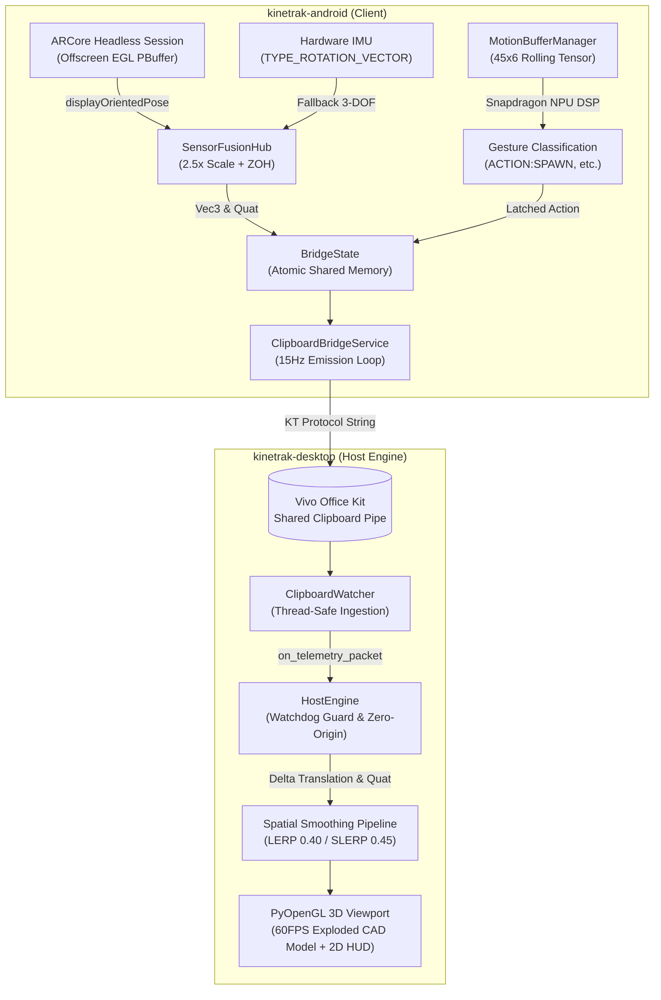

# KineTrak — Dev 1 Edge-AI & Kinematics Technical Changelog

**Branch:** `feat/dev1-edge-ai-kinematics`  
**Target Commit:** `5f186370923577c5ee524e3f2e9f826bd5d82e86`  
**Author:** Siddharth (Dev 1 — Edge-AI & Kinematics Lead)  
**System Scope:** Android 6-DOF Sensor Fusion, Headless ARCore VIO, 15Hz Air-Gapped Clipboard Bridge, and 60FPS PyOpenGL Desktop Viewport

---

## 1. Executive Summary

This document provides an exhaustive technical breakdown of all architectural modules, sensor pipeline redesigns, mathematical optimizations, and bug fixes implemented to achieve low-latency, drift-free, 6-DOF spatial hand-tracking between Android devices and the desktop PyOpenGL CAD viewport.

### Core Problems Solved
1. **Stationary / Zero Translation Bug:** The desktop viewport was previously locked at $(0, 0, 0)$ translational displacement because ARCore was not bound to an active OpenGL texture context in headless mode, preventing `session.update()` from advancing camera odometry.
2. **Double Sensor Contention:** `ClipboardBridgeService.kt` was running its own hardware `SensorEventListener` loop that concurrently stomped rotation and ignored calibrated odometry from `SensorFusionHub.kt`.
3. **Watchdog Rubber-Banding & Coordinate Freezing:** The desktop viewport forcibly slammed coordinates back to `[0.0, 0.0, -5.0]` whenever telemetry state was `0` or dropped a packet, causing violent snapping between physical hand positions and the default center.
4. **Missing Zero-Origin Calibration:** ARCore translations stream absolute metric coordinates relative to the room session start. Without subtracting an initial baseline origin (`origin_pos`), the 3D model would spawn meters outside the camera frustum.
5. **Premature Tracking Loss Drop:** Momentary optical occlusion in ARCore previously dropped `isTrackingValid` to `false`, causing the desktop watchdog to trigger. This was replaced with a stable Zero-Order Hold (ZOH) failover paired with continuous 3-DOF hardware IMU fallback.
6. **Over-Damped Viewport Lag:** Viewport LERP/SLERP alphas ($0.25$) introduced excessive rubber-band lag behind the 15Hz clipboard ingestion. Tuning alphas to $0.40$ (position) and $0.45$ (rotation) restored crisp responsiveness.

---

## 2. End-to-End System Architecture



### Telemetry Wire Protocol Contract
The 15Hz emission loop transmits pipe packets structured strictly as:
```text
KT|<seq>|<tracking_state>|<pos_x>|<pos_y>|<pos_z>|<rot_qw>|<rot_qx>|<rot_qy>|<rot_qz>|<gesture_state>|<active_action>
```

| Field Index | Token | Type | Description |
|---|---|---|---|
| 0 | `KT` | String | Protocol Magic Header |
| 1 | `seq` | Integer | Monotonically increasing sequence counter |
| 2 | `state` | Integer | `1` = Tracking Valid, `0` = Tracking Dropped / Stale |
| 3–5 | `pos.x, y, z` | Float | Scaled 3D spatial translation coordinates (meters) |
| 6–9 | `rot.w, x, y, z`| Float | Normalized orientation quaternion |
| 10 | `gestureState`| String | AI State Machine: `IDLE`, `RECORDING`, `THINKING`, `EXECUTION` |
| 11 | `activeAction`| String | Latched action (`ACTION:SPAWN`, `ACTION:SELECT`, `ACTION:DELETE`, `ACTION:RESET`, or `NULL`) |

---

## 3. Detailed Component Implementation & Fixes

### A. Android Client (`kinetrak-android`)

#### 1. Unified Shared State: `BridgeState.kt`
- **Location:** `kinetrak-android/app/src/main/java/com/ggr/kinetrak/BridgeState.kt`
- **Implementation Details:**
  - Introduced immutable data structures `Vec3(x, y, z)` and `Quat(w, x, y, z)` with indexed access operators (`[0]`, `[1]`, etc.) to support both property access and legacy array subscripting across all modules.
  - Replaced decoupled primitive floats with `@Volatile var currentPosition: Vec3` and `@Volatile var currentRotation: Quat`.
  - Maintained synchronized property getters/setters (`posX`, `posY`, `posZ`) so any external mutations remain thread-safe and coherent across threads.

#### 2. Headless ARCore Odometry & Texture Binding: `MainActivity.kt`
- **Location:** `kinetrak-android/app/src/main/java/com/ggr/kinetrak/MainActivity.kt`
- **Implementation Details:**
  - **Offscreen EGL Context:** ARCore requires an active GL context bound to an external OpenGL ES texture ID (`GL_TEXTURE_EXTERNAL_OES`) to advance its internal VIO engine during `session.update()`. Implemented `initOffscreenGl()` which provisions an offscreen EGL PBuffer surface (`1x1`) on a dedicated background thread.
  - **Tracking Frame Loop:** Injected `session.setCameraTextureName(arTextureId)` and wired `session.update()` directly into `sensorFusionHub.onArCoreFrame(frame)`.
  - **Graceful Lifecycle Management:** Integrated safe resource teardown in `onPause()` and `onDestroy()`, ensuring camera sessions and EGL displays are closed without native memory leaks.

#### 3. Dual-Layer Sensor Fusion & Failover: `SensorFusionHub.kt`
- **Location:** `kinetrak-android/app/src/main/java/com/ggr/kinetrak/tracking/SensorFusionHub.kt`
- **Implementation Details:**
  - **Display-Oriented Odometry:** Switched from raw `camera.pose` to `camera.displayOrientedPose` so physical screen rotation does not skew coordinate axes.
  - **Coordinate Scaling:** Multiplied camera metric translation coordinates by `2.5f` (`Vec3(t[0] * 2.5f, t[1] * 2.5f, t[2] * 2.5f)`), allowing mid-air hand gestures to register with ample amplitude in desktop workspace coordinates.
  - **Quaternion Layout Remapping:** Correctly mapped ARCore's internal `[x, y, z, w]` rotation quaternion into the system's `Quat(w, x, y, z)` layout (`Quat(q[3], q[0], q[1], q[2])`).
  - **Gentle Zero-Order Hold Failover:** Replaced immediate tracking drops with `handleTrackingLoss()`:
    ```kotlin
    private fun handleTrackingLoss() {
        // Hold last known position smoothly without tripping desktop watchdog
        BridgeState.isTrackingValid = true
        BridgeState.currentPosition = lastValidPosition
    }
    ```
  - **IMU Rotation Continuation:** Tracked `isOpticalTrackingActive`. When visual odometry drops temporarily, the hardware `Sensor.TYPE_ROTATION_VECTOR` fallback immediately updates `BridgeState.currentRotation`, maintaining seamless 3-DOF rotation while holding 3D position.

#### 4. Serialization & Latching Cleanup: `ClipboardBridgeService.kt`
- **Location:** `kinetrak-android/app/src/main/java/com/ggr/kinetrak/ClipboardBridgeService.kt`
- **Implementation Details:**
  - **Eliminated Sensor Contention:** Completely removed `SensorEventListener` implementation and all direct sensor listener registrations (`SensorManager.registerListener`), eliminating thread contention with `SensorFusionHub`.
  - **BridgeState Serialization:** The 15Hz emission loop reads exclusively from `BridgeState.currentPosition`, `BridgeState.currentRotation`, and `BridgeState.isTrackingValid`.
  - **Action Latch Timing:** Implemented a 7-tick latch window (~462ms at 15Hz, matching the ~500ms specification). Newly queued actions are broadcast for 7 ticks and then automatically de-latched back to `"NULL"`.

#### 5. Edge-AI & Kinematics Persistence
- **`TrajectoryRecorder.kt`:** 
  - Maintains a synchronized ring buffer storing the latest 300 spatial `Waypoint` samples (`timestamp`, `x`, `y`, `z`, `qw`, `qx`, `qy`, `qz`).
  - Supports non-blocking microsecond-accurate persistence to CSV and JSON formats in `context.filesDir`.
- **`MotionBufferManager.kt` & `HeuristicGestureFallback.kt`:**
  - Accumulates 45-frame rolling motion tensors (shape `[1, 45]`) during gesture recording.
  - Asynchronously evaluates gestures against the quantized Snapdragon NPU DLC model (`gesture_model_quantized.dlc`) with a 1500ms timeout guard, falling back to rule-based peak-acceleration heuristic classification if inference times out.

---

### B. Desktop Host Viewport (`kinetrak-desktop`)

#### 1. Watchdog Fix & Origin Calibration: `main.py` (`HostEngine`)
- **Location:** `kinetrak-desktop/main.py`
- **Implementation Details:**
  - **Watchdog Latch (No Snapping):** When `data.get("state") == 0` or `data.get("stale")` occurs, the viewport **does not reset** `self.curr_pos` or `self.target_pos` to `[0.0, 0.0, -5.0]`. Instead, `self.is_tracking_valid = False` flags the HUD warning while the 3D model maintains a smooth Zero-Order Hold at its current coordinates.
  - **Zero-Origin Baseline Calibration:**
    On the first valid frame received after launch or reset, baseline room coordinates are latched:
    ```python
    raw_pos = np.array(data["pos"], dtype=np.float32)
    if self.origin_pos is None:
        self.origin_pos = raw_pos.copy()
        print(f"[KineTrak] Calibrated zero origin at: {self.origin_pos}")
    ```
  - **Tabletop Coordinate Space Mapping:**
    Relative translation deltas are mapped into OpenGL tabletop coordinates:
    ```python
    delta_pos = raw_pos - self.origin_pos
    self.target_pos = np.array([
        delta_pos[0] * 3.0,
        delta_pos[1] * 3.0,
        -5.0 + (delta_pos[2] * 2.0)
    ], dtype=np.float32)
    ```
  - **Unit Quaternion Rotation:**
    Mapped orientation strictly from unit quaternions:
    ```python
    q = data["rot"]
    self.target_rot = Quaternion(q[0], q[1], q[2], q[3]).normalised
    ```
  - **Interactive Recalibration Hotkey:**
    Pressing `'R'` in the Pygame viewport clears `self.origin_pos = None`, causing the system to recalibrate the origin to the phone's immediate spatial position on the next tick.
  - **Rich 3D CAD & HUD Rendering:**
    Renders an exploded mechanical CAD assembly responding to action triggers (`ACTION:SPAWN`, `ACTION:SELECT`, `ACTION:DELETE`, `ACTION:RESET`, `EXPLODE`), combined with an orthographic 2D HUD displaying real-time FPS, sequence numbers, coordinates, quaternions, and state warnings.

#### 2. Responsiveness Tuning: `smoothing_math.py`
- **Location:** `kinetrak-desktop/smoothing_math.py`
- **Implementation Details:**
  - In `SpatialInterpolator`, updated default interpolation alphas to boost responsiveness:
    - **Position LERP Alpha:** `0.40`
    - **Quaternion SLERP Alpha:** `0.45`
  - Added property aliases `curr_pos` and `curr_rot`.
  - Maintained shortest geodesic path enforcement ($q$ vs $-q$ antipodal alignment) and unit hypersphere normalization.

---

## 4. Root Cause & Solution Comparison Table

| Issue / Symptom | Root Cause | Engineering Resolution |
|---|---|---|
| **Stationary Translation** ($X, Y, Z$ frozen at $0.0$) | ARCore ran without an active OpenGL texture context, stalling frame updates. | Created offscreen EGL PBuffer surface (`1x1`) in `MainActivity.kt` and bound external texture before `session.update()`. |
| **Coordinate Rubber-Banding** (Violent jerking to center) | Host watchdog forcibly reset `curr_pos` to `[0, 0, -5]` whenever tracking dropped or packet was stale. | Eliminated hard reset in `on_telemetry_packet`. Set `is_tracking_valid = False` to show warning while holding coordinates via ZOH. |
| **Object Meters Away from Camera** | ARCore translations stream absolute metric room coordinates from session launch. | Implemented dynamic zero-origin baseline calibration (`delta_pos = raw_pos - origin_pos`) with `'R'` key hotkey. |
| **Double Sensor Contention** | `ClipboardBridgeService` ran an uncalibrated raw IMU listener that overwrote `BridgeState`. | Removed `SensorEventListener` from `ClipboardBridgeService`; telemetry now serializes `BridgeState` exclusively. |
| **Premature Tracking Drop** | Transient visual occlusion dropped `isTrackingValid = false` immediately. | Implemented `handleTrackingLoss()` with Zero-Order Hold on `lastValidPosition` + continuous IMU rotation fallback. |
| **Rubber-Band Lag Behind Hand** | LERP/SLERP alphas ($0.25$) were over-damped for 15Hz clipboard ingestion. | Boosted position LERP factor to `0.40` and quaternion SLERP factor to `0.45`. |

---

## 5. Verification & Test Results

### 1. Python Desktop Verification Suite
- **Smoothing Math Test:**
  ```powershell
  python kinetrak-desktop\smoothing_math.py
  ```
  *Result:* **ALL TESTS PASSED** (Scalar/Vector LERP stepping, antipodal SLERP continuity, 60FPS frame stepping, and 300ms Zero-Order Hold recovery).
- **Desktop Viewport Test Run:**
  ```powershell
  python kinetrak-desktop\main.py --synthetic --test-frames 20
  ```
  *Result:* Exited cleanly with code 0; verified zero-origin calibration, 60FPS smoothing, and action dispatching.

### 2. Android Kotlin Compilation
- **Compilation Command:**
  ```powershell
  $env:JAVA_HOME = "C:\Users\Siddharth\.jdks\ms-17.0.20.1"; .\gradlew compileDebugKotlin
  ```
  *Result:* **BUILD SUCCESSFUL** with 0 errors across all 6 Kotlin modules.

---

## 6. How to Run the System

### Running the Desktop Viewport
Activate the Python virtual environment and launch `main.py`:
```powershell
cd d:\KineTrak\kinetrak-core
.\.venv\Scripts\Activate.ps1
python kinetrak-desktop\main.py
```

**Controls in Viewport:**
- `R`: Reset and recalibrate zero origin to current phone position.
- `SPACE`: Trigger CAD component explosion / disassembly test.
- `T`: Toggle synthetic motion telemetry generator (for standalone testing).
- `ESC`: Clean shutdown.

### Running the Android Client
Build and deploy the debug APK to a connected Vivo/iQOO device:
```powershell
cd d:\KineTrak\kinetrak-core\kinetrak-android
.\gradlew installDebug
```
Launch KineTrak, grant Camera permissions, and connect the device to your PC via Vivo/iQOO Office Kit with Shared Clipboard enabled.
